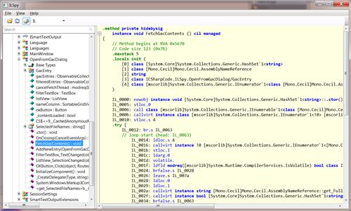
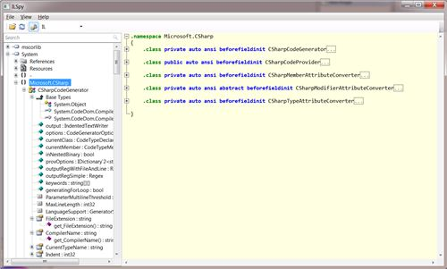
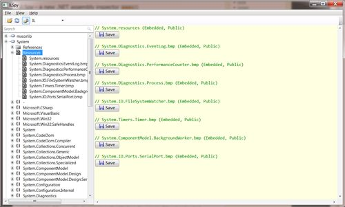
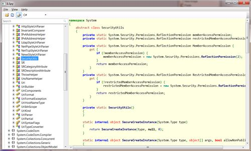
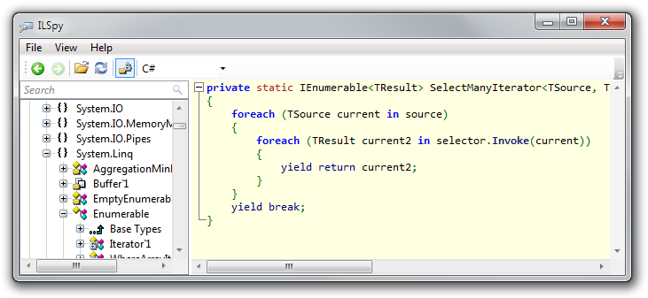

ILSpy is the open-source .NET assembly browser and decompiler.

Development started after Red Gate [announced](https://web.archive.org/web/20110205074826/http://www.red-gate.com/products/dotnet-development/reflector/announcement) that the free version of .NET Reflector would cease to exist by end of February 2011.

ILSpy requires the [.NET Framework 4.0](http://www.microsoft.com/downloads/en/details.aspx?FamilyID=5765d7a8-7722-4888-a970-ac39b33fd8ab&amp;displaylang=en).

Important links:

* [Issue Tracker](https://github.com/icsharpcode/ILSpy/issues)
* [ILSpy plugin list](https://github.com/icsharpcode/ILSpy/wiki/Plugins)
* [Build server](https://ci.appveyor.com/project/icsharpcode/ilspy)

## Release History

Want to know when major new features are added? When a new stable version is released?
[Follow us on Twitter!](http://twitter.com/ilspy)

Detailed [release history](https://github.com/icsharpcode/ILSpy/wiki/Release-History) is tracked in our wiki.

## ILSpy Features

* Assembly browsing
* IL Disassembly
* Support C# 5.0 "async"
* Decompilation to C#
    * Supports lambdas and 'yield return'
    * Shows XML documentation
* Decompilation to VB
* Saving of resources
* Save decompiled assembly as .csproj
* Search for types/methods/properties (substring)
* Hyperlink-based type/method/property navigation
* Base/Derived types navigation
* Navigation history
* BAML to XAML decompiler
* Save Assembly as C# Project
* Find usage of field/method
* Extensible via [plugins](https://github.com/icsharpcode/ILSpy/wiki/Plugins) (MEF)
* Assembly Lists  

## Screencasts, Demo & How To Videos

* [Overview of features in ILSpy Build 296](http://www.youtube.com/watch?v=CDi5yT1ekuU) Resolution: 720p  

## Screenshots

Viewing IL (Build 199)

  
Navigating Types (Build 199)

  
Saving Resources (Build 199)

  
Decompiling a Type to C# (Build 199)

  
Decompiling method with 'yield return' (Build 528)

